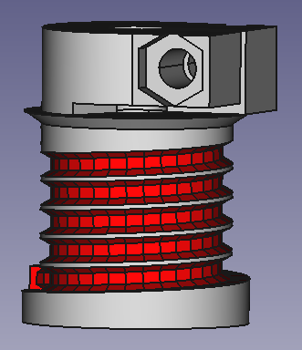

# threaded_pulley
freecad parametric threaded pulley
Can be used for cable robot

# dependency
install FreeCAD_Python module https://github.com/iboris2/FreeCAD_Python

# use

Use SpreeadSheet to configure
- cable len
- cable diameter
- pulley diameter

pulley height and turn number is automaticaly computed

